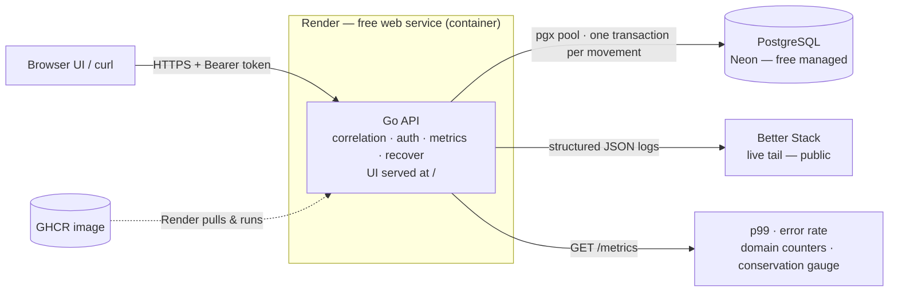

# LedgerWallet

A small **wallet + peer-to-peer transfer** service whose entire point is staying **correct under
concurrency and failure**. Money is always **integer paise** (`bigint`), movements are **exactly-once**,
balances never go negative, and the global balance sum is conserved — enforced at the database, not in
application memory.

- **Backend:** Go 1.22 (stdlib `net/http` routing, `pgx` for Postgres, Prometheus + `slog`)
- **Database:** PostgreSQL (Neon in production, `postgres:16` locally)
- **UI:** static operations console (`web/`), deployable to Vercel
- **Cost:** ₹0 on free tiers, no credit card (Render + Neon + Vercel)

---

## Architecture



Full diagrams (including the single-transaction money-movement flow) are in
[`docs/ARCHITECTURE.md`](docs/ARCHITECTURE.md).

## Quickstart (local, one command)

Requires Docker + Docker Compose. **No Go toolchain needed** — the binary is compiled inside the image.

```bash
docker compose up --build
```

This starts Postgres and the API, runs migrations, and seeds the genesis treasury. The API is on
`http://localhost:8080`. In another terminal, reproduce every correctness gate:

```bash
./scripts/burst.sh
# or against a deployed URL:
BASE_URL=https://your-app.onrender.com ./scripts/burst.sh
```

Expected tail: `ALL GATES PASSED ✅`.

---

## API

Auth is a bearer token per user: `Authorization: Bearer <token>`.

| Method | Path | Description |
|---|---|---|
| `POST` | `/auth/register` | Bootstrap: `{ "username": "alice" }` → `{ id, username, token }` |
| `POST` | `/wallets` | Get-or-create the caller's wallet → `{ id, user_id, balance_paise }` |
| `GET` | `/wallets/{id}` | Current balance |
| `POST` | `/wallets/{id}/topup` | Fund from treasury (test seeding): `{ "amount_paise": 100000 }` |
| `POST` | `/transfers` | `{ from, to, amount_paise, idempotency_key }` |
| `GET` | `/transfers/{id}` | Transfer status |
| `POST` | `/transfers/{id}/reverse` | Refund: `{ "idempotency_key": "..." }` |
| `GET` | `/healthz` `/readyz` `/metrics` | Liveness, DB-readiness, Prometheus |

Response conventions:
- A **completed** transfer, an **idempotent replay**, and a **declined** transfer all return **HTTP 200**
  with the transfer body (`status` is `completed` / `declined`). This keeps replays byte-identical to the
  original response — the exactly-once guarantee is about the *result*, not the HTTP code.
- Same idempotency key + **different body** → **409**.
- Reversing an already-reversed transfer → **409**.

### Example

```bash
BASE=http://localhost:8080
TOK=$(curl -s -X POST $BASE/auth/register -d '{"username":"alice"}' | grep -o '"token":"[^"]*"' | cut -d'"' -f4)
WID=$(curl -s -X POST $BASE/wallets -H "Authorization: Bearer $TOK" | grep -o '"id":"[^"]*"' | cut -d'"' -f4)
curl -s -X POST $BASE/wallets/$WID/topup -H "Authorization: Bearer $TOK" -d '{"amount_paise":100000}'
```

---

## Observability

- **Structured JSON logs** to stdout, every line carrying a **correlation id** (`X-Correlation-ID`,
  echoed to the response and honored if the client sends one). Domain events include
  `wallet.created`, `transfer.created`, `transfer.debited`, `transfer.credited`,
  `transfer.declined_insufficient_funds`, `transfer.idempotent_replay`, `transfer.conflict`,
  `reversal.created`, `reversal.already_reversed`.
- **Metrics** at `/metrics`: request rate + status (`http_requests_total`), latency histogram for p99
  (`http_request_duration_seconds`), and **domain counters** — transfers created / declined-insufficient /
  idempotent-replays / conflicts / reversals — plus a **`wallet_total_balance_paise` gauge** so
  conservation is watchable live.

Trace a declined transfer end-to-end:

```bash
docker compose logs -f app | grep declined_insufficient_funds
# copy its correlation_id, then:
docker compose logs app | grep <correlation_id>
```

---

## Verification

Two layers of proof:

1. **End-to-end (against the running service):** `./scripts/burst.sh` reproduces all three hard gates
   plus the reversal probe and prints `ALL GATES PASSED ✅`.
2. **DB-mechanism self-test (no app needed):** `scripts/db_selftest.sql` applies the exact SQL the Go
   code uses and asserts each invariant directly in Postgres:

   ```bash
   docker compose up -d db
   docker compose exec -T db psql -U app -d wallet -f - < internal/store/migrations/0001_init.sql
   docker compose exec -T db psql -U app -d wallet -f - < scripts/db_selftest.sql
   ```

   Expected: get-or-create yields one wallet, duplicate idempotency-key insert returns null,
   the conditional debit declines with 0 rows (balance unchanged), the ledger pair sums to zero,
   a second reversal is blocked by `UNIQUE(reverses_transfer_id)`, and the `CHECK` rejects negatives.

## Deploy (₹0, no card)### 1. Database — Neon (free, no card)
1. Create a project at neon.tech → copy the connection string.
2. Ensure it ends with `?sslmode=require`.

### 2. API — Render (free web service, no card)
1. New → **Web Service** → connect your GitHub repo → Runtime: **Docker** (uses this `Dockerfile`).
2. Env vars:
   - `DATABASE_URL` = your Neon string (`...?sslmode=require`)
   - `ALLOWED_ORIGIN` = your Vercel UI origin (e.g. `https://ledger-wallet.vercel.app`)
3. Deploy → note the public `https://<app>.onrender.com` URL.
   > Free instances sleep after 15 min idle; the first request wakes them (Go cold start is ~1–2s).
   > Warm it with `curl <url>/healthz` before a burst.

### 3. UI — Vercel (free)
1. New Project → import the repo → **Root Directory = `web/`** → deploy (it's static, no build).
2. Open the site, paste your Render API URL into the **API base URL** field, Save.

Why this split: the API needs a persistent container (Dockerfile, non-root, healthcheck, connection
pool, `/metrics`) which serverless platforms fight; the UI is static and belongs on Vercel.

---

## Project layout

```
cmd/server/main.go        entrypoint, graceful shutdown, gauge updater, healthcheck subcommand
internal/config/          env config
internal/obs/             slog JSON logging + Prometheus metrics
internal/store/           pgx pool, migrations, wallet + transfer/reversal logic (the invariants)
internal/store/migrations/0001_init.sql   schema + constraints + treasury seed
internal/httpx/           router, middleware (auth/cors/correlation/metrics/recover), handlers
scripts/burst.sh          one-command correctness burst (all gates + reversal)
web/                      static operations console (Vercel)
Dockerfile                multi-stage → distroless non-root + HEALTHCHECK
docker-compose.yml        app + Postgres, one command
docs/WRITEUP.md           one-page design reasoning
```

See [`docs/WRITEUP.md`](docs/WRITEUP.md) for the design reasoning: the simplest-correct mechanism,
rejected alternatives, where idempotency lives, and the consistency/availability call.
