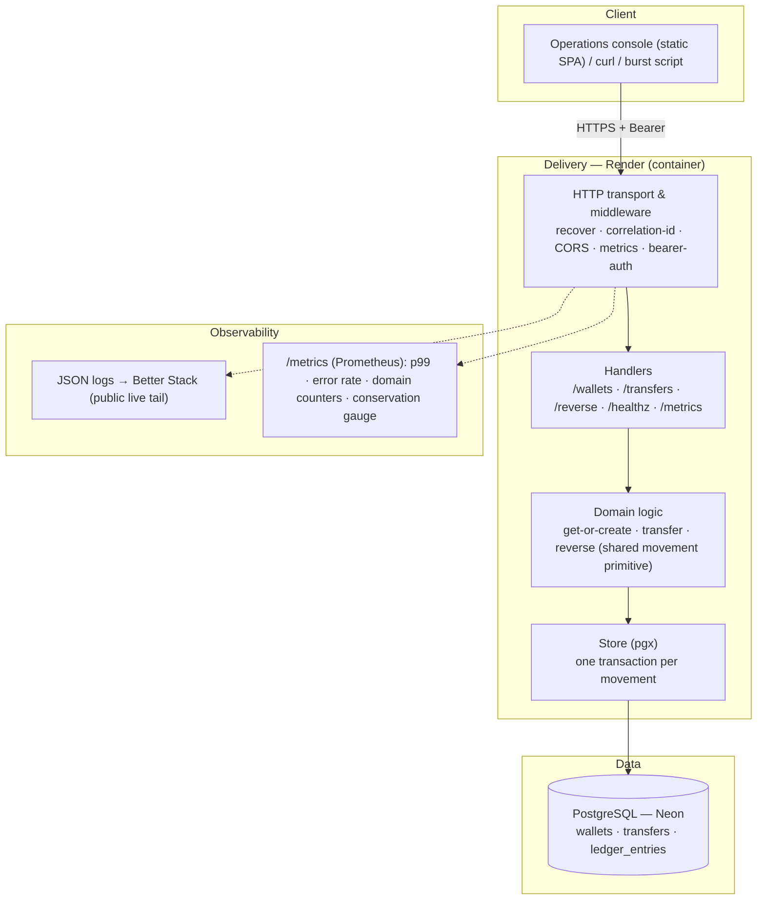
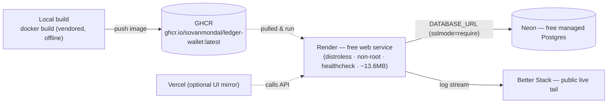
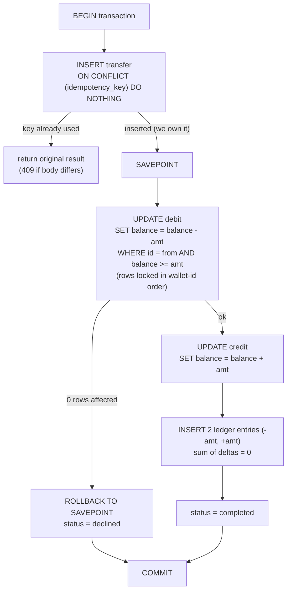

# LedgerWallet — Architecture

## 1. Layered architecture (separation of concerns)


## 2. Deployment topology (₹0, no card)


## 3. Request lifecycle — a transfer
```mermaid
sequenceDiagram
  participant C as Client
  participant M as Middleware
  participant H as Handler
  participant DB as PostgreSQL (Neon)
  C->>M: POST /transfers (Bearer, from, to, amount_paise, idempotency_key)
  M->>M: assign correlation id, resolve token to user, start latency timer
  M->>H: authorized request
  H->>DB: BEGIN; INSERT transfer ON CONFLICT (idempotency_key) DO NOTHING
  alt key already used
    DB-->>H: 0 rows; SELECT existing
    H-->>C: original result (409 if body differs)
  else new movement
    H->>DB: SAVEPOINT; conditional debit; credit; ledger pair; status; COMMIT
    DB-->>H: committed
    H-->>C: 200 transfer (completed | declined)
  end
  Note over H,DB: idempotency key and money movement commit in ONE transaction
```

## 4. The money movement — one transaction (correctness core)


## 5. How each invariant is enforced
| Invariant | Enforcement |
|---|---|
| Race-free get-or-create | `UNIQUE(user_id)` + `INSERT … ON CONFLICT DO NOTHING` |
| Exactly-once | `UNIQUE(idempotency_key)` committed in the **same transaction** as the movement |
| No overdraft | atomic conditional debit (`… WHERE balance >= amt`) + `CHECK (balance >= 0)` |
| Conservation | append-only `ledger_entries`; each movement writes `(-amt, +amt)` → `sum = 0` |
| Deadlock-free | both rows updated in ascending wallet-id order |
| No double refund | `UNIQUE(reverses_transfer_id)` |

## 6. Data model
- `users(id, username UNIQUE, token UNIQUE)`
- `wallets(id, user_id UNIQUE, balance_paise bigint CHECK >= 0)`
- `transfers(id, idempotency_key UNIQUE, from_wallet, to_wallet, amount_paise bigint CHECK > 0, kind, status, decline_reason, reverses_transfer_id UNIQUE, request_fingerprint)`
- `ledger_entries(id, transfer_id, wallet_id, delta_paise bigint)`  — `sum(delta_paise) = 0` is the conservation proof.

All money is **integer paise** (`bigint`). Consistency over availability: a single Postgres primary is the linearizable source of truth.
