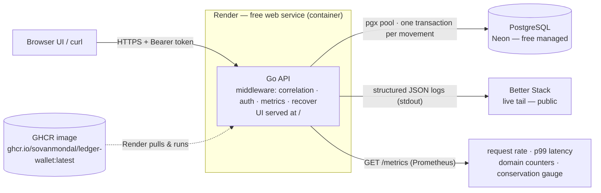
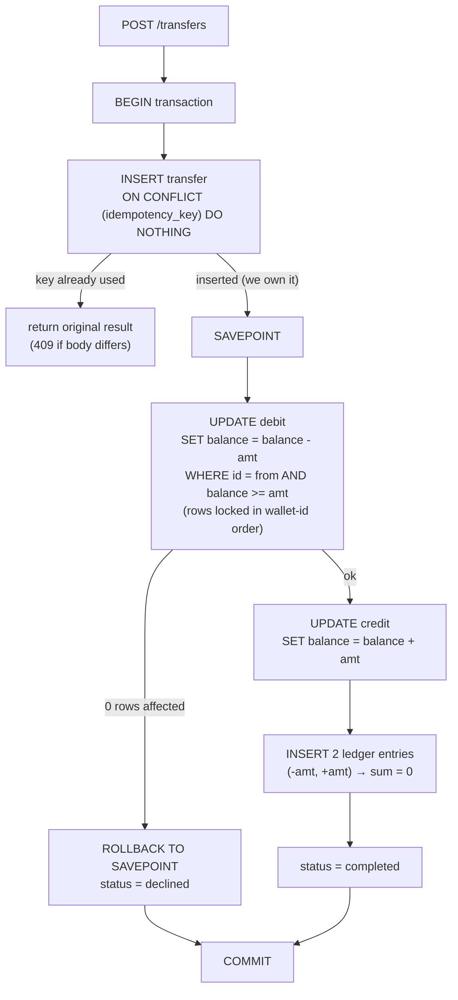

# LedgerWallet — Architecture

## System overview

## The money movement — one transaction (the correctness core)
Every transfer, top-up, and reversal goes through the **same** primitive, in a single DB transaction.

## How each invariant is enforced
- **Race-free get-or-create** → `UNIQUE(user_id)` + `INSERT … ON CONFLICT DO NOTHING`.
- **Exactly-once** → `UNIQUE(idempotency_key)`, inserted in the **same transaction** as the movement.
- **No overdraft** → atomic conditional debit (`… WHERE balance >= amt`) + `CHECK (balance >= 0)`.
- **Conservation** → append-only `ledger_entries`; every movement writes a `(-amt, +amt)` pair, so
  `sum(delta_paise) = 0` always.
- **Deadlock-free** → the two balance rows are always updated in ascending wallet-id order.

## Data model (tables)
`users(id, username, token)` · `wallets(id, user_id UNIQUE, balance_paise CHECK >= 0)` ·
`transfers(id, idempotency_key UNIQUE, from, to, amount_paise, kind, status, reverses_transfer_id UNIQUE, request_fingerprint)` ·
`ledger_entries(transfer_id, wallet_id, delta_paise)`
